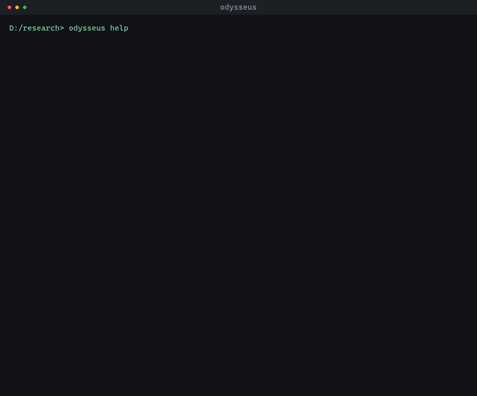
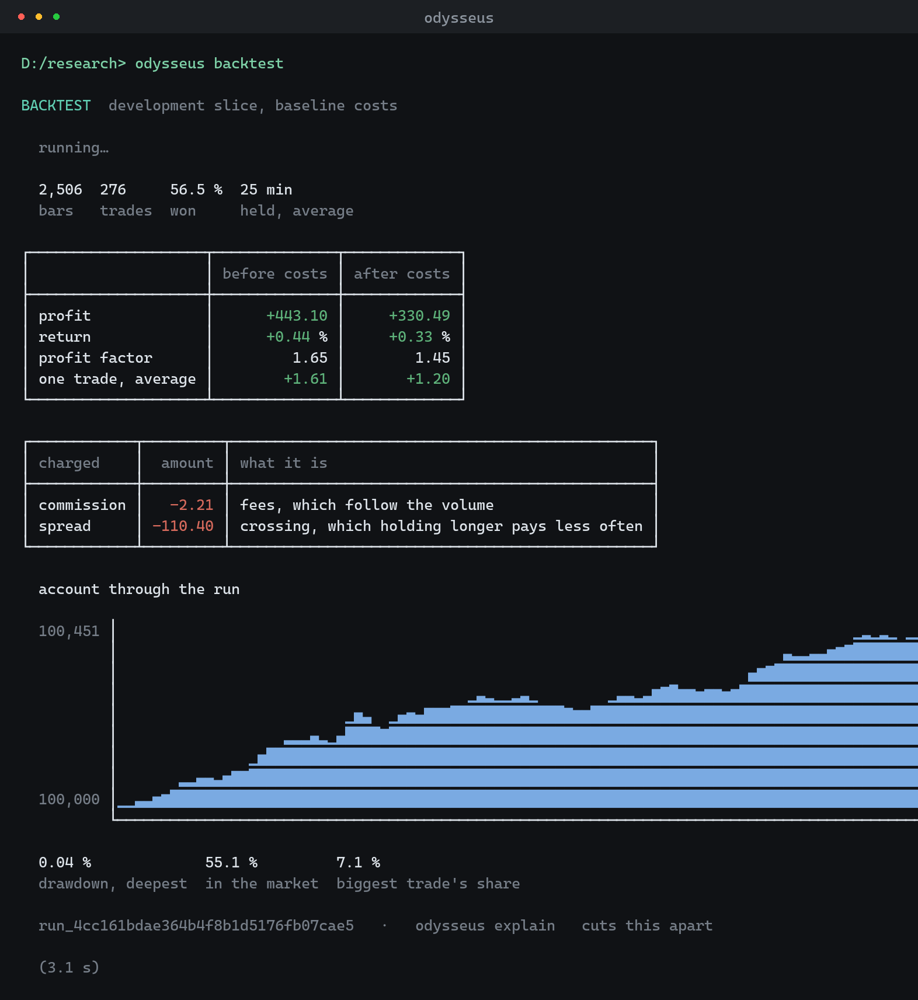
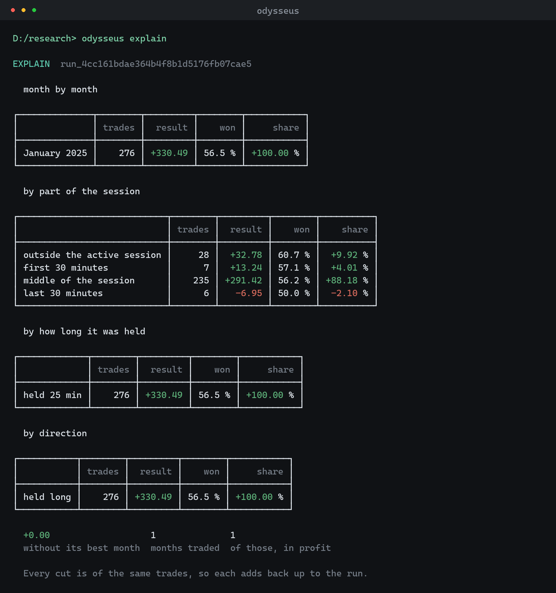

# Odysseus

An MCP server that turns any AI agent into a quantitative researcher — and holds it to the discipline
that makes a result mean something.

You run it locally beside your own agent. It downloads real market history into one StockSharp storage
every project shares, measures what is actually in it, translates a formal hypothesis into a real
[StockSharp](https://github.com/StockSharp/StockSharp) `Strategy` class, compiles it, backtests it with
costs, searches its parameters, and reports what every run came to.

**It measures. It does not judge.** There is no score in it, no threshold, no accept-or-reject. Whether
a drawdown is bearable or a return is worth having depends on what you are researching, and that is
your call, not a server's.

---

## Why an MCP server

Because the agent is the researcher, and it already exists.

A backtesting product with a chat window has to ship a model, a conversation, an interface, and an
opinion about what a good strategy is. This ships none of them. Your agent brings the reasoning; this
brings the parts an agent is bad at on its own — real data that cannot quietly change under a result,
a translator that turns a hypothesis into the same code every time, an emulator that charges for the
spread, and a slice of history it is not allowed to look at until the end.

That last one is the point. An agent asked to find a profitable strategy will find one. The only thing
that separates a finding from a search is data the search could not reach.

---

## What it does

```
create_project
  → import_history          real bars, into the shared storage
  → analyze_market          what the instrument does, before you propose anything for it
  → propose_spec            the hypothesis, as a formal document
  → build_candidate         translated to C#, compiled, hashed
  → evaluate_candidate      six fixed runs, reported in full
  → measure_on_closed_data  once, against data nobody was allowed to see
  → complete_strategy       you decide; the server keeps the code and every number behind it
```

Forty-eight tools in all: projects, connectors, data, instrument lookup, hypotheses, candidates and a
check of whether one gives the same answer twice, backtests, evaluations, a seeded genetic search and a
walk-forward over it, the closed-data measurement, paper trading against a broker's paper account, the
record of what you completed, and — off unless an operator turns it on — installing StockSharp products
on the machine the server runs on.

`analyze_market` measures the project's dataset — how much the instrument moves, whether its moves continue
or come back, and what followed the events a strategy would trade. Read it before proposing anything: a
breakout hypothesis on an instrument whose breakouts led nowhere costs a generation of candidates to
disprove, and these numbers say so beforehand.

### The data discipline

Bars live in one StockSharp market-data storage that every project shares — a folder of its own,
`ODYSSEUS_MARKET_DATA` (`./market-data` by default). A project does not copy them: its dataset is a
symbol list, a candle length and a range, and runs read that range out of the shared storage. A run is
recorded by what it read — instrument, candle length, from and to — so importing the same range again
finds every run already made over it.

A dataset is cut by time into three parts: the first 60% of the range to form a hypothesis on, the next
20% to measure it on, and the last 20% closed. `describe_split` says where each part lies; what keeps
the closed part closed is that no tool hands out its bars and that it is measured **once** — not once per
project, but once per stretch of history, recorded in a ledger beside the projects, because starting a
second project and importing the same dates does not make the answer unseen. The ledger checks and
records a measurement in one step, so two projects asking at the same moment cannot both get through.

### What a measurement looks like

Six runs, always the same six: the development slice, the validation slice, the validation slice again
with costs half again as high, and the development slice cut into three consecutive windows run with
the same numbers. Profit, drawdown, trade count, win rate, exposure, what share of the result rests on a
single trade, the spread between the windows, what survived the higher costs. No verdict — that part is
yours.

The three windows ask whether the result is spread over the history or made in one stretch of it. They
do not choose numbers per window; `run_walk_forward` does that — it searches the declared numbers on
one stretch, tests the choice on the stretch after it, and steps forward window by window.

A signal is acted on when its bar closes, and the order fills at the price the market stood at then.
Whether a result survives an entry that lands a bar later — what it is worth without the price the
signal was seen at — is asked separately, by running `run_backtest` under the `entryOneBarLater`
scenario beside the `baseline` and `costsX15` ones.

---

## Running it

You need the [.NET 10 SDK](https://dotnet.microsoft.com/download).

```bash
git clone https://github.com/StockSharp/StockSharp.git "StockSharp (GitHub)"
git clone https://github.com/StockSharp/Odysseus.git
cd Odysseus
dotnet build -c Release
```

The trading platform is built from source, so its repository is cloned beside this one, into the
folder the build looks for it in. To keep it somewhere else, name that place as `StockSharpSource`
in a `Directory.Build.local.props` beside `Directory.Build.props`.

That produces `src/Odysseus.Server/bin/Release/net10.0/Odysseus.Server.exe`, and the command line
beside it as `src/Odysseus.Cli/bin/Release/net10.0/odysseus.exe`.

Point your agent at the server over stdio:

```json
{
  "mcpServers": {
    "odysseus": {
      "command": "path/to/Odysseus.Server.exe",
      "env": {
        "ODYSSEUS_PROJECTS_ROOT": "path/to/where/projects/should/live",
        "ODYSSEUS_MARKET_DATA": "path/to/the/shared/market-data/storage"
      }
    }
  }
}
```

Then ask it to `import_demo_dataset` and work through a hypothesis. The bundled dataset is generated,
so nothing measured on it says anything about any market — it is there to prove the machinery runs
without an account.

### With real data

Real data comes through a **StockSharp connector**, and the server is not compiled against one. It
cannot be: a running server cannot compile itself, so the connector arrives as a published NuGet
package that the server downloads and loads into a context of its own.
Which one is yours to say.

Put the credentials that connector takes in a file:

```
key: ...
secret: ...
```

and point `ODYSSEUS_BROKER_KEYS` at it. A path rather than the values themselves, because a value in
the environment is inherited by every child process — including the worker that runs candidates — and
shows up in a process listing.

Then say which connector, either in a file that `ODYSSEUS_BROKER_CONNECTOR` points at:

```json
{ "packageId": "StockSharp.Binance", "settings": {} }
```

or, while the server runs, with `list_connectors`, `describe_connector` and `select_connector`.
`describe_connector` reports every setting a package accepts and the values each one allows, so a
choice can be written from what the connector says about itself rather than from documentation.

Two more variables bound what may be downloaded, because all three of those tools run downloaded code —
what a connector is for and whether it can be told it is on a paper account are properties of an
instance, so reading a package builds the adapter inside it: `ODYSSEUS_CONNECTOR_SOURCES` (the feeds,
`https://api.nuget.org/v3/index.json` by default) and `ODYSSEUS_CONNECTOR_ALLOW` (the package name
prefixes, `StockSharp.` by default). Both are start-up decisions and neither is reachable from a tool.
An allow-list that was set and came out empty allows nothing rather than everything. A server started
with `--hosted` refuses all three tools: its connector is chosen when the process starts.

Without a connector everything else still works: the demo dataset, `analyze_market`, every backtest,
the closed-data measurement and `complete_strategy` all read history that is already imported.
`describe_server` says which half of the product you have.

History can also come from a **remote StockSharp storage server** (Hydra) instead of the broker. Name it
in a file that `ODYSSEUS_REMOTE_STORAGE` points at:

```json
{ "address": "10.0.0.5:5002", "login": "...", "password": "..." }
```

`import_history` then reads bars from that server into the shared local storage, and every run reads
them locally from there. The server is reached through the `StockSharp.Fix` package, downloaded and
loaded the way a connector is, so `ODYSSEUS_CONNECTOR_ALLOW` has to admit it. The broker, if one is
named, still does the paper trading.

Paper accounts only, and it is checked rather than asserted. Every connector is put into demo mode
before it is configured and checked again afterwards, and one that has no demo mode — or that will not
stay in it — is refused rather than used carefully.

### A deployment outlives the session that started it

`deploy_candidate` starts a **process of its own** — one deployment, one process — and that process
keeps trading when the agent disconnects, when the MCP server exits, and until something stops it. This
is the single most important change in how the product behaves, and it cuts both ways: nothing is
flattened by a dropped connection any more, and nothing stops a strategy except somebody stopping it.

What survives is a directory under the projects root:

```
projects/runners/<deploymentId>/
    launch.json      what to run and how to reach the broker
    runner.json      how to find the process, and how to tell it from a reused process number
    strategy.dll     the exact assembly being traded
    journal.jsonl    one line per state change, including what it was holding
    runner.log       what the runner has to say to a person
```

A later session — a different agent, a different process, next week — reads that directory rather than
anything held in memory. `list_deployments` reports what was recorded next to what was found when the
process was looked for, and the four findings are not interchangeable:

| `runner` | What it means |
|---|---|
| `attached` | Connected and answering. The numbers are current. |
| `gone` | The process is not there. Whatever it held at the broker was left exactly as it stood. |
| `unresponsive` | The process is alive and not answering. It may still be holding a position and may still be trading. |
| `unknown` | No record at all, or one this build will not talk to. |

`gone` and `unresponsive` are the difference between nobody holding a position and somebody holding
one, which is why there are four values rather than two. Stopping a `gone` runner records it as
interrupted with the last line of its journal; stopping an `unresponsive` one is **refused and records
nothing**, because writing "stopped" about a process that may still be trading is the one lie the
product is built to avoid.

A stop is a decision about the position and carries the answer with it. A death is not: a crash, a
signal, a machine restart and an expired mandate all leave the position exactly as it stood, and none
of them ever closes one. Nothing restarts by itself after a reboot either — what comes back is the
record, not the trading.

Two practical consequences:

- **Deploying needs a connector *named*, not bound.** The runner loads its own connector in its own
  process, so the server can deploy without having loaded one — but it refuses when neither
  `select_connector` nor `ODYSSEUS_BROKER_CONNECTOR` has named one.
- **Two roots are two registries.** A shell and an MCP server with different `ODYSSEUS_PROJECTS_ROOT`
  values each see runners the other does not. `describe_server` reports the root it is using.

No tool can kill a runner, and that is deliberate: a tool that could would be a way to leave a position
with nothing watching it. Killing is a person's, at a terminal — `odysseus runner kill <deploymentId>`
prints what is about to be left open and asks for the identifier back, or use the task manager.

### Live trading, for an operator

Everything above trades on a paper account, and the MCP server cannot do anything else. Live trading is
a property a process is in **from birth**, decided by a file the operator names to the process that is
going to trade, and it is unreachable from the agent channel by construction:

- No tool takes a mode, and none could be added without changing the design.
- The MCP server passes the paper mandate as a literal at the one call site that could say otherwise.
- It **removes** `ODYSSEUS_LIVE_MANDATE` and `ODYSSEUS_LIVE_PHRASE` from the environment of every child
  it starts, and sets the first only from a path the caller passed explicitly — which the server always
  leaves empty — and the second from nothing at all. An operator who exported either in the shell that
  started the server still gets paper runners from it.
- The runner re-checks everything itself, from the file, on its own clock: expiry, the connector build
  it actually loaded, the instrument, the position at the last price, and the account the broker
  reports. Any mismatch and it starts nothing.
- **Holding the file is not the permission.** The phrase written in it has to come back through a
  channel the file cannot supply, before the strategy starts.

The mandate is JSON, and **nothing in this product ever writes one** — `odysseus mandate template`
prints an example to standard output for a person to save, and prints what to do with it on standard
error, so `odysseus mandate template > mandate.json` still gives you a file that parses:

```json
{
  "schema": 1,
  "phrase": "trade real money on U1234567 until the thirtieth",
  "account": "U1234567",
  "connector": {
    "packageId": "StockSharp.Example",
    "packageVersion": "1.2.3",
    "adapter": "StockSharp.Example.ExampleMessageAdapter"
  },
  "symbols": ["AAPL"],
  "maxPositionNotional": 5000,
  "expiresAt": "2026-09-30T00:00:00Z"
}
```

Every field is required and every one of them narrows what is permitted: one account, one connector
build, a handful of instruments, a ceiling on the position, and an expiry so a permission nobody
remembered to revoke stops working by itself.

Putting a runner into live mode therefore takes all of this, and each step is somebody deciding
something:

1. **Write the mandate yourself** and save it where only you can write it. No tool, no agent and no part
   of this product writes one: a file the software can create is a file it can be talked into creating.
2. **Point `ODYSSEUS_LIVE_MANDATE` at it** in the shell you are about to start the runner from. Set and
   unreadable is a refusal, not a fall back to paper — an operator who set it meant a real account, and
   running their strategy against a demo one instead would be safe and dishonest.
3. **Start `Odysseus.Runner` yourself**, giving it the runner home to work out of. A runner the MCP
   server launched has neither variable, so this is the only way in.
4. **Type the phrase back.** Started at a terminal, the runner prints the account, the instruments, the
   cap and the expiry, and asks for the phrase written in the mandate. It is compared exactly — spacing
   and capitalisation as written, no trimming, no case folding, no culture's idea of equality — and it
   is never printed for you to copy. Where there is no terminal to ask at, the same phrase has to be in
   `ODYSSEUS_LIVE_PHRASE` instead.
5. **The runner re-checks everything** against the broker that answers, and starts the strategy only if
   all of it agrees.

A phrase that does not match, and a start with nobody to ask and no `ODYSSEUS_LIVE_PHRASE`, both end the
same way as every other unusable mandate: nothing starts, the journal records the refusal against a
position of zero, and nothing is quietly downgraded to paper.

A live runner says so everywhere and says it first: in its greeting, in every state report, in
`runner.json` — so a session that cannot reach it still reports "live, unreachable", which is the state
most in need of a person — in the deployment row, and in the audit log.

### Installing StockSharp products

Six tools install, update, remove and list StockSharp's own applications — Designer, Terminal, Hydra
and the rest — on the machine the server runs on. **They are off by default and most machines cannot
use them at all**, which is the ordinary state rather than a fault. Three things have to be true, and
`get_installer_state` reports all three without installing anything:

- **The installer console is on this machine.** Odysseus drives
  `StockSharp.Installer.Console` as a process; it does not link the vendor's installer library, and it
  never downloads the program. Linking it would drag a cross-repository dependency, a StockSharp
  account, a licence and a private feed into a server that fetches public packages anonymously.
  Point `ODYSSEUS_INSTALLER` at the executable, or put it in an `installer` folder beside the server.
- **An operator has said which products may be touched.** `ODYSSEUS_PRODUCT_ALLOW` is a
  semicolon-separated list of numeric product ids — `9;10;1137` for Designer, Terminal and Runner.
  Unset means none. This is the opposite default from `ODYSSEUS_CONNECTOR_ALLOW`, and deliberately:
  half the product needs a connector, and no part of the research loop needs a StockSharp product.
- **This machine has a StockSharp account signed in.** The installer reads it from
  `%USERPROFILE%\Documents\StockSharp\credentials.json`, which is machine-wide and has no switch —
  there is no way to pass an account from here. Without it the installer stops and waits for an email
  address to be typed at a keyboard, so the tools refuse rather than hang.

Products land under the projects root, in `products/<id>`, and no tool takes a directory: a path that
arrives as an argument is a path that writes anywhere. Every invocation's output is captured whole
under `products/invocations/`, and the answer carries the end of it — the program has no
machine-readable output, so what could not be read comes back as text rather than being dropped. A
server started with `--hosted` refuses all six.

Both listings need the network even though they sound local: the installer reloads its whole product
catalogue on every call and has no offline mode.

### From a terminal

The same research, in columns instead of JSON — the same services, the same numbers, laid out for a
person rather than a parser:



```bash
dotnet run --project src/Odysseus.Cli -- new "my study"
dotnet run --project src/Odysseus.Cli -- demo
dotnet run --project src/Odysseus.Cli -- propose samples/hypothesis.json
dotnet run --project src/Odysseus.Cli -- build
dotnet run --project src/Odysseus.Cli -- backtest
dotnet run --project src/Odysseus.Cli -- measure
dotnet run --project src/Odysseus.Cli -- closed
dotnet run --project src/Odysseus.Cli -- complete "why you believe it"
```

`samples/hypothesis.json` is a real specification: a breakout confirmed by volume, with an ATR stop and
a close at the session end. It is what the walkthrough above proposes, and a test holds it to both the
server's own checks and the published schema.

A backtest reports what the run cost as well as what it made, because only one of the two charges can
be traded around: holding longer pays the spread less often, while the fees follow the volume either
way.



And any run can be cut apart — by month, by part of the session, by how long a position was held, by
direction. Every cut is of the same trades, so each adds back up to the run. A result that came from
one month, or from the last half hour of the day, says so here rather than in six weeks of paper.



---

## What it will not do

- **It will not tell you a strategy is good.** It reports what happened and leaves the reading to you.
- **It will not trade real money from the agent channel.** Every deployment the MCP server starts is on
  a paper account, and there is no argument, no specification field and no stored value that can change
  that: live trading is decided by a file read at start-up by a process the server cannot create. An
  operator can start such a process themselves; nothing reachable from a tool can.
- **It will not close a position because something died.** A stop carries the decision about the
  position. A crash, a signal, a reboot and an expired mandate do not, and none of them acquires one by
  default.
- **It will not let you measure the closed slice twice.** That is the whole of its value.
- **It will not pretend a backtest is a result.** The emulator fills against bars; a fill that never
  comes is the most common difference between a backtest and an account.

---

## The contract

**What the tools return is not written down anywhere, on purpose.** The tools describe themselves:
every one carries a description written for the agent that has to choose it without trying it first,
and every argument says what it is, with a test that fails the suite if one does not. Connect and call
`tools/list` — that is the contract, and it cannot go stale. A static copy of an output shape can only
drift from the code that produces it.

The roster itself is held to this page: a test compares what `tools/list` answers against an explicit
list grouped exactly as above, so a tool added, removed or renamed fails the suite until the count here
is corrected with it.

**What is written down is what you send in**, because that has to be got right before the server ever
sees it:

- [`strategy-spec.schema.json`](schemas/strategy-spec.schema.json) — the hypothesis document, with
  every expression kind the vocabulary has. Tests validate the shipped sample, a specification using
  every kind at once, and what the server writes back; other tests check that specifications the server
  refuses are refused by the schema too, and that its enumerations are the ones the code declares.
- [`error.schema.json`](schemas/error.schema.json) — the shape every failure arrives in, whose
  category vocabulary a test holds against the enum the server branches on.

None of that is worth anything if it only runs when somebody remembers to run it, so
[`build.yml`](.github/workflows/build.yml) runs it: every push and every pull request restores, builds the
whole solution in Release — warnings are errors there, so that step is a gate before any test starts —
and then runs every test, keeping a JUnit report per test assembly with the run. A failing test fails
the build. It needs nothing configured to pass: the few tests that want a broker account look for
credentials, find none, and are skipped.

---

## Licence

The StockSharp Custom License Notice, as in every StockSharp repository — see LICENSE, and the EULA it
points to. A connector is fetched as a NuGet package at run time and remains under its own terms; nothing
of StockSharp — source, binaries or keys — belongs in this repository.

There is no telemetry. A fresh installation makes no network call except to the broker, and only when
asked to.
